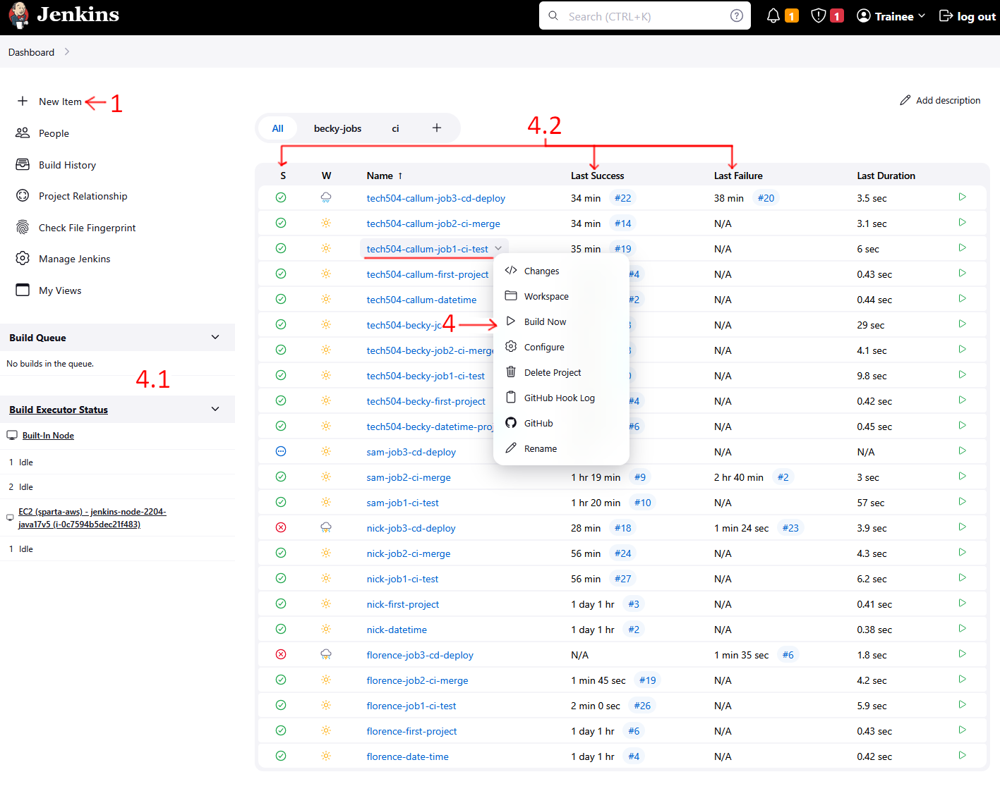
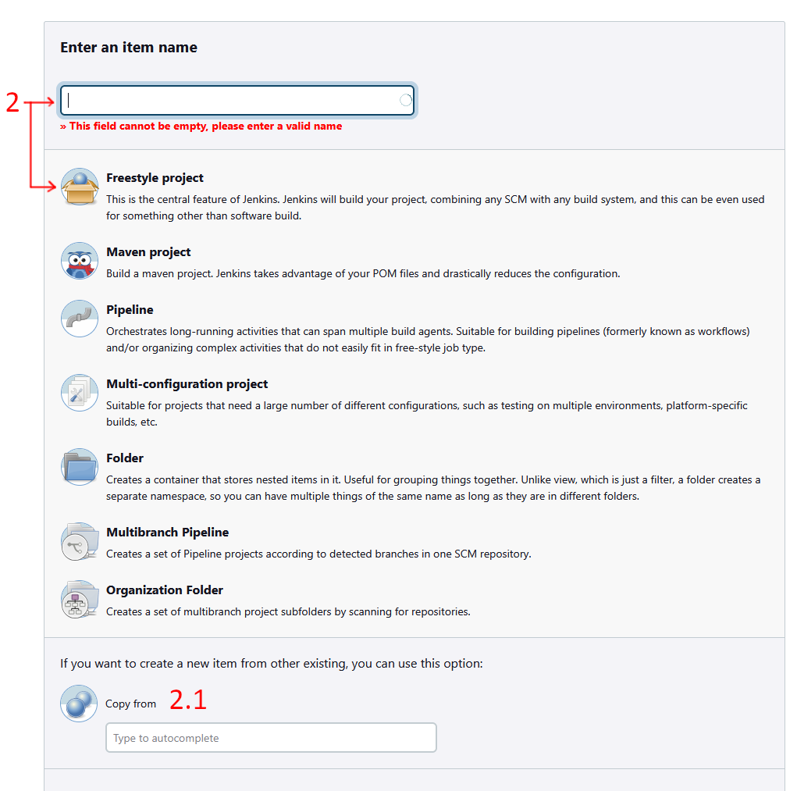
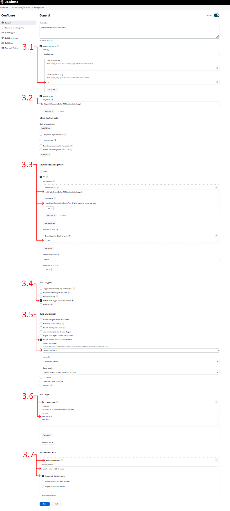
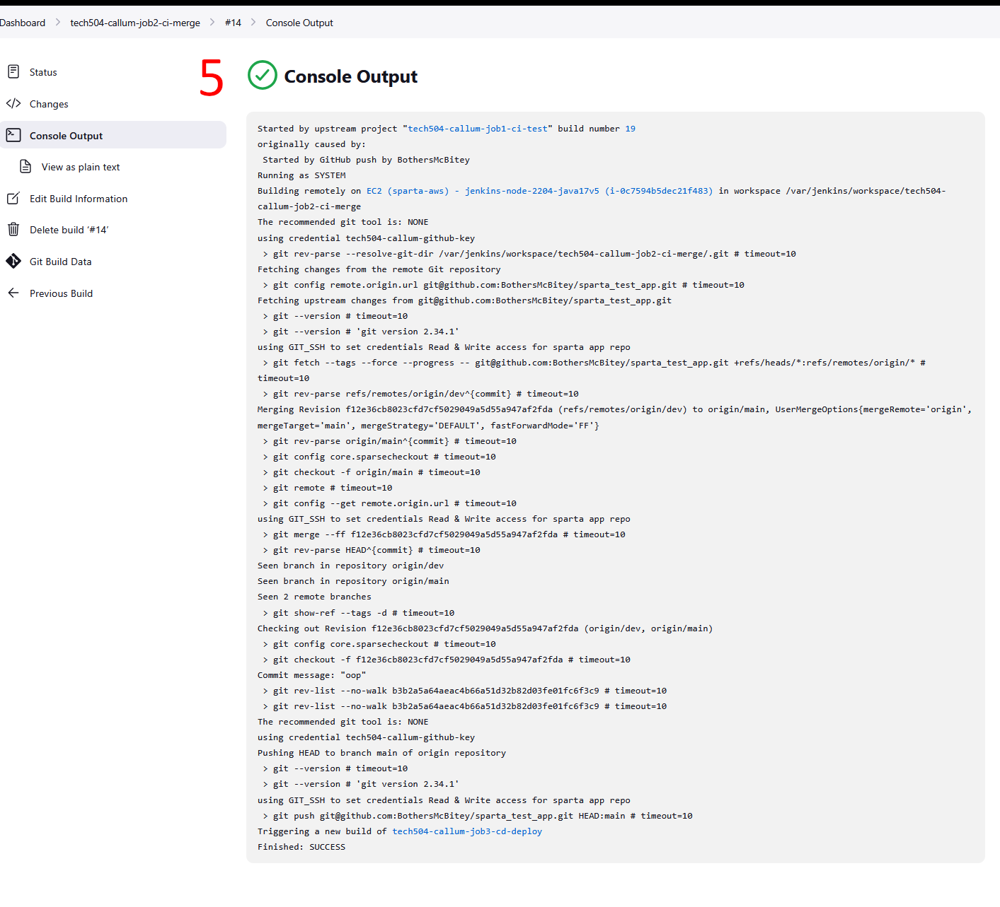

# Intro to CI/CD and Jenkins
- [Intro to CI/CD and Jenkins](#intro-to-cicd-and-jenkins)
  - [What is CI?](#what-is-ci)
  - [What is CD?](#what-is-cd)
- [What is Jenkins?](#what-is-jenkins)
    - [Drawbacks](#drawbacks)
  - [Stages of Jenkins](#stages-of-jenkins)
  - [Alternatives](#alternatives)
- [Why build a CICD Pipeline?](#why-build-a-cicd-pipeline)
- [How does Jenkins Work?](#how-does-jenkins-work)
  - [Example Setup for a Jenkins Pipeline](#example-setup-for-a-jenkins-pipeline)
    - [Annotated Screenshots](#annotated-screenshots)

## What is CI?
- continuous integration
- CI often triggered when updated code gets pushed to particular branches
  - depends on the specific git workflow used
  - in the case of feature branches
- If the code passes automated tests, it gets integrated (merged) into the dev/main branch.
  - A fail safe that picks up (some) errors
- helps keep software stable

## What is CD?
Two versions:
- Continuous Delivery
  - Build the software, turn it into an artifact that can be deployed whenever the go is given
  - Usually deployment depends on manual approval
- Continuous Deployment
  - Deploy application (often straight to production)

# What is Jenkins?
- open source automation server
- mostly used for CICD
  -  has other uses
-  automation is usually good
-  extensible - 1800+ plugins
-  scalability - Jenkins can distribute workload across agents/nodes
-  Lots of community support
-  cross-platform

### Drawbacks
- Can get pretty complicated
- Not always easy to optimize
- Plugin management can get busy

## Stages of Jenkins
1. **CI:** source code management (SCM)
2. **CI:** Build code
3. **CI:** Run tests
4. **CD:** Packaging into deployable artifact
5. **CD:** Deploy package and run it
6. **CD:** Monitoring

## Alternatives
- GitLab
- CircleCI
- Travis CI
- Github Actions
- Bamboo
- GoCD
- TeamCity
- Azure Devops Pipelines

# Why build a CICD Pipeline?
- Can be used for user testing:
  - feature toggles
  - A/B Testing
  - Blue/Green deployment
- Shortens time from creation to reception.
  - Benefits end users
  - Feedback comes back faster
- Bug fixes can go fast
- Generally al lot of speeed benefits

# How does Jenkins Work?
- When a developer pushes to certain branches, github/etc will trigger a webhook to alert listeners a change has been made
- Jenkins master node either runs the pipeline itself, or sends it to an agent node
  - using an agent node is generally better, or at least safer
- The pipeline might be the following steps:
   1. Test code
   2. Merge into main/product branch
   3. build/deploy code
- It can then directly connect to production machines to deploy it automatically

## Example Setup for a Jenkins Pipeline
Screenshots of the Jenkins interface annotated to match this guide can be found [below](#annotated-screenshots).
1. From the Jenkins Dashboard, hit `+ New Item` in the top left. This starts the process of building a project (one step in the pipeline).
2. Name the project and choose `Freestyle project`.
   1. For future projects you can clone existing ones, which saves time and reduces errors.
3. This is where all the functional stuff is defined. Our first job is to test code when changes are made to the `dev` branch of our repo. We configure:
   1. How many builds it keeps saved in history.
   2. Give it the URL of our git repo
   3. In `Source Code Management` we give it the git ssh url, credentials to access the repo, and tell it which branch to use.
   4. We set a build trigger for a Github Webhook
   5. Because the app uses NodeJS, in `Build Environment` we tell it to provide a NodeJS install and which version to use.
   6. Under `Build Steps` we set a shell script for it to run, which will install the app code and run the unit tests.
   7. Later, when we have the next stage, we set a `Post-build Action` to trigger the next step of the pipeline IF this one succeeds. Alternatively, under `Build Triggers` we can set a job to only run after a previous job is completed.
4. Back on the dashboard you run this first step manually from the project list. 
   1. You'll see it go through the job queue and the run on the left hand panel. 
   2. When it's done you can see the result in the job list.
5. The console output for each run can be viewed by clicking on the job in the list view.
6. In the weather (W) column on the dashboard it gives a weather based, representation of the last 5 runs and their success rate, where sunny means all is good and stormy means they have all failed.

### Annotated Screenshots

