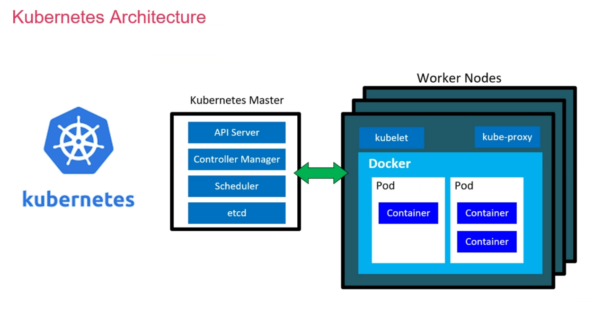

# Kubernetes (The Notorious K8s)

- [Kubernetes (The Notorious K8s)](#kubernetes-the-notorious-k8s)
- [Wherefore art thou Kubernetes?](#wherefore-art-thou-kubernetes)
    - [Tales of K8s' Exploits](#tales-of-k8s-exploits)
- [Architecture](#architecture)
  - [What's a cluster?](#whats-a-cluster)
    - [What's a Master Node?](#whats-a-master-node)
    - [What's a Worker Node?](#whats-a-worker-node)
- [Basics](#basics)
  - [Managed Services vs. DIY](#managed-services-vs-diy)
  - [K8s on a Plane](#k8s-on-a-plane)
  - [What is a Container?](#what-is-a-container)
  - [What is a Pod?](#what-is-a-pod)
- [Misc.](#misc)
    - [Service](#service)
    - [Volumes](#volumes)
    - [Config Map](#config-map)
    - [Secret](#secret)
    - [Namespace](#namespace)
    - [ReplicaSet](#replicaset)
    - [Deployment](#deployment)
    - [Mitigating security concerns with containers](#mitigating-security-concerns-with-containers)
    - [Pros v Cons of maintained images](#pros-v-cons-of-maintained-images)
      - [Pros](#pros)
      - [Cons](#cons)
- [Commands](#commands)

# Wherefore art thou Kubernetes?
- It's a container organization/orchestration tool.
  - manages container workloads.
- open source
- highly portable
- self-healing (automatically recovers from failures)
- Auto-scaling for containers
- loadbalancing
- rolling updates & rollbacks
- define desired state of application, it goes and does make do
- designed to have no single point-of-failure by running across multiple machines
  - You run it on one machine if you want

### Tales of K8s' Exploits
- Pokemon GO was run on GKE (Google Kubernetes Engine)
  - Experienced 50x expected traffic on launch. Kubernetes' make it work 

# Architecture

## What's a cluster?
- made of at least 1 master node + one worker node
- Minikube - single work node, good for dev testing
  - master and node on one machine
  - simplified architecture
- AKS (Azure, managed service)
  - Azure takes care of the master node entirely (You can't look or touch).
  - Not charged for the master node.
  - You pay for the VMs running the worker nodes

### What's a Master Node?
- runs control plane components
- it manages everything. Like you'd expect something called a "master node" to do.
- For production, how many do you need?
  - Recommended minimum of 3 master/control planes nodes
  - If using a managed service, this is handled for you

### What's a Worker Node?
- sometimes just called nodes
- this is where the containers are deployed and run
- they work on the data plane

# Basics
## Managed Services vs. DIY
- It's a challenge to run K8s in production
  - dedicated K8s teams
- Security patches and stuff 
- Managed service saves time
- Loss of control

## K8s on a Plane

## What is a Container?
- NOT an object
- used within a pod (which is an object)

## What is a Pod?
- a group of 1 or more containers
- they share resources (storage and network)
- run on a worker node
- specify how to run the containers
- smallest unit in K8s
- have internal IP addresses
- Pods are Ephemeral - you could lose data

# Misc.
### Service

### Volumes
persistent data

### Config Map
key-value database

### Secret
only base64 encoded, not encrypted

### Namespace
Logical grouping for an application's resources. Default namespace is called "default"

### ReplicaSet
Creates more pods. Usually identical. They're also Stateless (other types of set exist).

### Deployment
Defines the replica sets

### Mitigating security concerns with containers
- Using officially maintained images
- use automated vulnerability scanning on container registries
- set up own security scanning tools for your images
- NEVER run a container with root privileges
- monitor/log container activity

### Pros v Cons of maintained images
#### Pros
- better security
- Stability
- documentation & support
- more likely to follow standards/best practice
- often optimized versions (speed/size/etc)
#### Cons
- Dependent on maintainer schedule for fixes

# Commands
- `kubectl create -f [file]`
- `kubectl get [all/deploy/replicasets/pod/etc]`
- `kubectl describe [resource_id]`
- `kubectl edit [resource type] [resource]`
  - e.g. `kubectl edit deploy nginx-deployment`